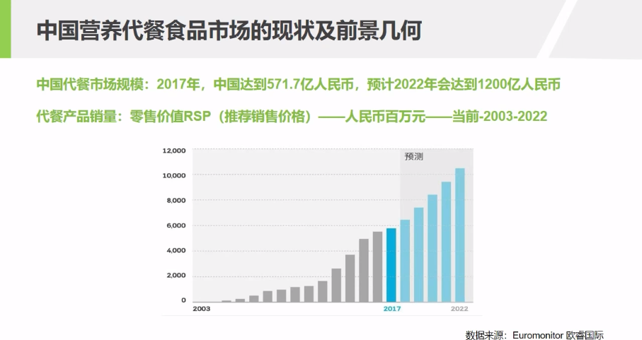
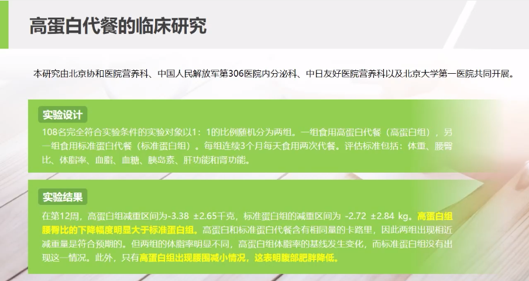
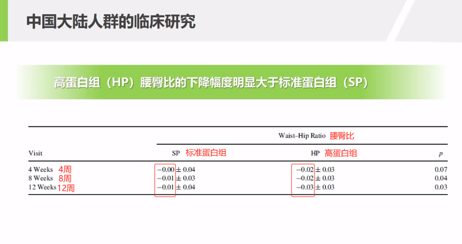
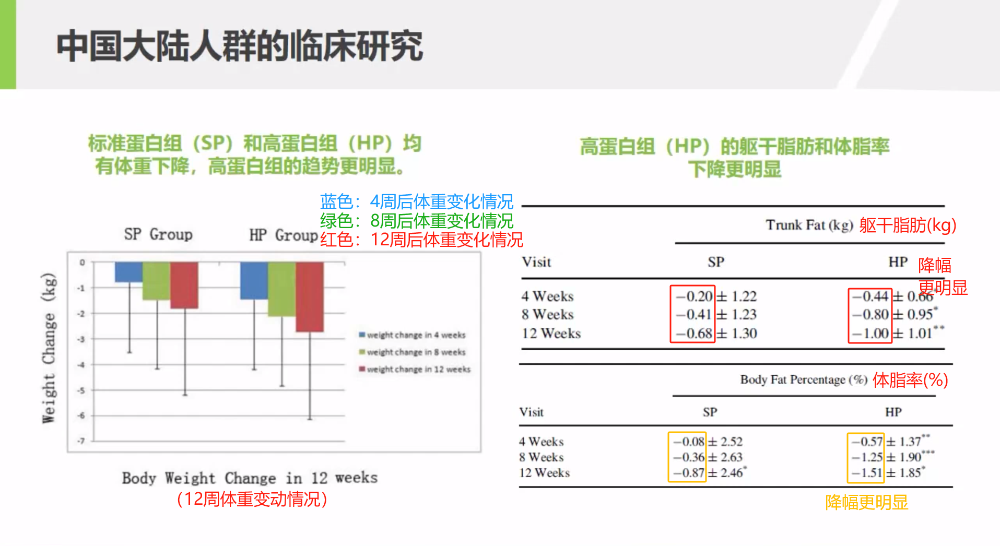
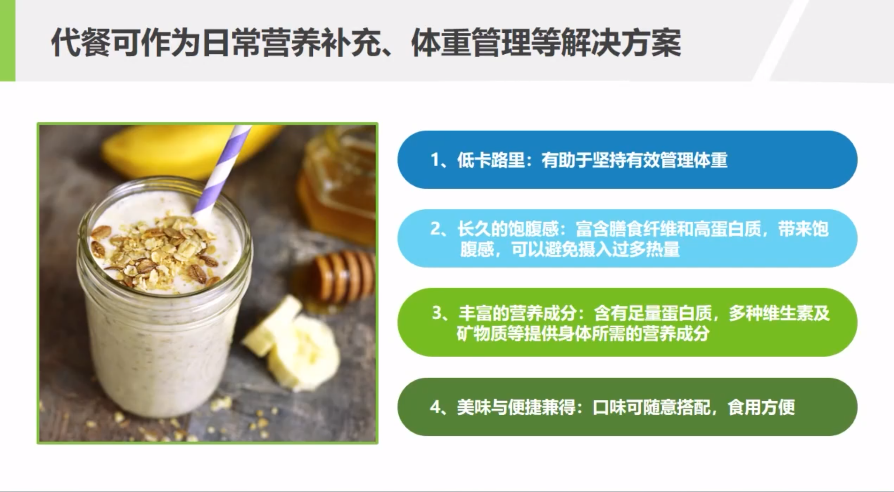
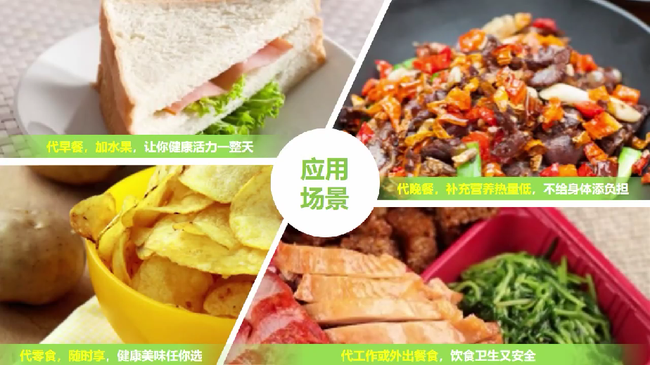
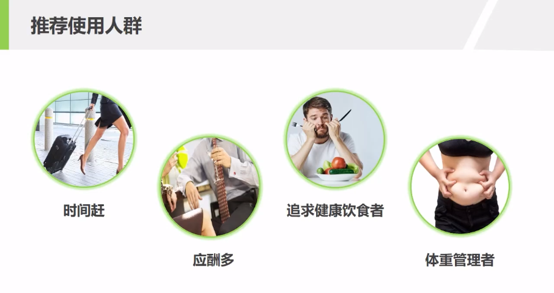

# 代餐行业趋势分析

2023-6-14

内容概要：

- 代餐的定义
- 代餐行业趋势

中国代餐市场规模2017年中国达到571.7亿人民币，预计2022年会达到1,200亿人民币。还有在更精准的数据分析中，我们能看到代餐食品、营养补充饮品，在近几年和接下来的几年复合增长率都在高位上。

现下大部分人的生活状态——

- 赶时间
- 安全忧
- 多样难
- 应酬多
- 图方便

现代人“三多”——

- 饭局多
- 出差多
- 压力多

导致年轻人空有健康观念，终究败给了现实生活……

> **权威数据**
>
> 《中国居民营养与慢性病状况报告》（2015年发布）
>
> 虽然我国居民 **膳食能量供给** 充足，**体格发育** 与 **营养状况** 总体改善，但居民 **膳食结构仍存在不合理** 现象——
>
> - **豆类、奶类** 消费量依然偏低
> - **脂肪** 摄入量过多
> - 部分地区 **营养不良** 的问题依然存在
> - **超重肥胖** 问题凸显
>
> **与膳食营养相关的慢性病** 对我国居民健康的威胁日益严重。18 岁及以上成年人中——
>
> - 超重率：30.1%（2019年为 34.3%，肥胖率 16.4%，超重肥胖超 50%，据《中国居民营养与慢性病状况报告（2020）年》）
> - 高血压患病率：25.2%（2018年为 23.2%，据央视新闻微博）
> - 糖尿病患病率：9.7%（2017年为 10.9%，据《中国糖尿病流行病学报告》）
>
> 较 2002 年呈 **明显上升趋势**。
>
> DIY：根据 2020 年最新版，我国成年居民超重肥胖率超 50%，6~17 岁的儿童青少年接近 20%，6 岁以下的儿童达到 10%。所以可以用超重肥胖 **上升速度较快**、**流行水平较高**、**全人群均受影响** 来描述当前人群的超重肥胖形势，这也预示着这项工作将面临巨大挑战

【**代餐的科学性**】

多个国家的监管机构，对于符合法规/营养标准、或经科学实验论证的代餐，认可其为一种 **高营养密度**、**控制热量** 的安全又健康的饮食方式。

> 关于代餐的权威性
>
> 代餐作为食物已经被权威机构认可（**EFSA**, European Food Safety Authority, 欧洲食品安全局）。在许多国家规定一天当中只是替代1~2顿正餐的代餐，应该视为 **食品管理** 无需征求医生的意见，原因是——
>
> - 同等热量供应下，**代餐** 比 **传统热量限制饮食** 具有更好的减肥效果；
> - 干预强度方面，传统热量限制饮食是代餐饮食的 **3 倍** 之多。

【**什么是代餐**】

代餐是指取代部分或全部的正餐。广义上讲，任何能够替代部分或全部正餐的食物都可以称其为代餐。

- 代餐定义：取代部分或全部正餐的食物，我们统称为代餐（Meal Replacement）
- 从特点看，科学代餐需具备——
  - 高纤维
  - 低热量
  - 多种营养素
  - 持续饱腹感
  - 高蛋白
- 从供能看：热量可控（150~500 千卡）
- 从种类看：可以是——
  - 代餐粉
  - 代餐棒
  - 代餐奶昔

【**高蛋白代餐的重要性**】

为什么说高蛋白也是科学代餐的必备特征呢？这是有临床依据的。一项 2015 年开展的针对国人的高蛋白代餐临床研究表明：高蛋白组的实测数据在减重、降低体脂率、腰臀比，以及躯干脂肪方面，要明显优于标准对照组：

【**代餐四原则**】

代餐作为日常营养补充、体重管理等解决方案，需要掌握四个原则：

1. 低卡路里
2. 长久的饱腹感
3. 丰富的营养成分
4. 美味与便捷兼得

【**代餐的应用场景**】

- 代早餐，加水果
- 代晚餐，补充营养热量低
- 代零食，随时享
- 代工作餐/外出餐食，卫生又安全

【**代餐适用人群**】

- 赶时间人士
- 应酬多人士
- 追求健康饮食者
- 体重管理者

